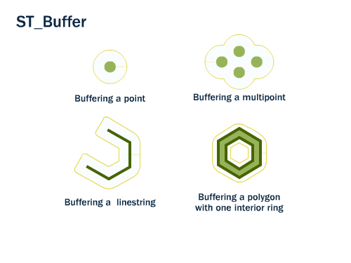

Implementation Profile: **Buffer**.

> Returns a geometric object representing all points whose distance from this geometric object is less than or equal to a given distance.

## Source

Two standards define this operation at different levels -- the abstract semantics, and the
concrete SQL binding an Implementation Profile is specifically meant to add (OGC 14-065 WPS 2.0.2
§7.5.3, "down to the supported data exchange formats"):

- [OGC 06-103r4 Simple Feature Access - Part 1: Common Architecture](https://www.ogc.org/standards/sfa/), §6.1.23 -- the
  operation's abstract definition (this is what [its Concept](../../concept/vector-geometry-processing/)
  and [Generic Profile](../../generic-profile/geometry-buffer/) are grounded in too).
- ISO/IEC 13249-3:2016 *SQL multimedia and application packages -- Part 3: Spatial*, §5.1.5 ST_Buffer
  -- the same operation bound to SQL: the `ST_Geometry` type and the `ST_Buffer` function name,
  of which this Implementation Profile's `prefLabel` (`Buffer`) is the SFA name without the `ST_`
  prefix SQL/MM adds. SQL/MM is why this tier exists at all: it is, precisely, an implementation
  profile of Simple Feature Access for SQL -- the same abstract operation, bound to one concrete
  language and type system, still not any one vendor's specific deployment of it.

## Illustration

Source: [PostGIS Workshop -- Geometry Returning Functions](https://postgis.net/workshops/postgis-intro/geometry_returning.html), © Paul Ramsey, Mark Leslie, PostGIS contributors, licensed [CC BY-SA 3.0 US](http://creativecommons.org/licenses/by-sa/3.0/us/).

## Data formats

`geometry`, `result`: GML -- the register's minimal default (Table 21, D: Declare), grounded in the real ZOO-Project Geonovum testbed, whose SQL/MM processes expose geometries as `text/xml` (GML) only, never WKT or GeoJSON (checked across `Intersects`, `Buffer`, `Intersection`). `distance` (Number) carries no data format.

Per [OGC 14-065 WPS 2.0.2 §7.5.4 Table 21](https://docs.ogc.org/is/14-065/14-065.html#32), a specific deployment may *Extend* (E, footnote d) this minimal default with additional formats it happens to support -- this tier intentionally does not pre-empt that.

## Relations

- `refinesGenericProfile`: [`generic-profiles.generic-profile.geometry-buffer`](../../generic-profile/geometry-buffer/)

## Register position

Third tier of the four-tier model (OGC 14-065 WPS 2.0.2 §7.5): Concept -> Generic Profile ->
**Implementation Profile** -> Implementation (instance level). The fourth tier is not part of
this register: see [`ospd.process-profiles.sqlmm.buffer`](https://github.com/GeoLabs/bblocks-process-profiles/tree/master/_sources/sqlmm/buffer)
in `bblocks-process-profiles` -- a real process of the ZOO-Project Geonovum testbed
(<https://host1.tb.geonovum.geolabs.fr/ogc-api/processes/Buffer>), which matches this tier's own minimal default (GML), specialised to one concrete version and root element, GML 3.1.0 Polygon.
